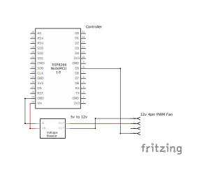

# Smart PWM Fan Controller for NAD M33 / BluOS Streamers

A modular, robust, and highly optimized ESP8266-based cooling controller for premium BluOS music streamers (like the NAD M33). The system dynamically adjusts fan speeds based on the streamer's power state, stores configurations persistently in EEPROM, and hosts a state-of-the-art interactive Web UI with 5-minute real-time Chart.js temperature graphing.

---

## Key Features

* 🤫 **Silent 25kHz Ultrasonic PWM**: Reconfigures the ESP8266 PWM clock frequency to 25kHz (completely ultrasonic) to eliminate low-speed fan coil whine, motor vibration, and humming.
* ⚡ **High-Torque Kickstart Loop**: Automatically pulses the fan to 100% duty cycle for 800ms whenever transitioning from a stopped state, guaranteeing the fan overcomes starting friction at low speeds.
* 💾 **Persistent EEPROM Configuration**: Stores power mode, target fan speed, target BluOS network endpoint, and temperature monitoring settings securely in non-volatile memory with validation checks.
* 📶 **Zero-Hardcode WiFi Provisioning**: Utilizes **WiFiManager** to dynamically connect to local networks via a captive setup portal, completely eliminating hardcoded passwords in the binary.
* 📉 **Interactive Chart.js Visualizations**: Replaces manual SVG drawing with Chart.js, rendering a responsive multi-sensor temperature timeline. Supports index-based hover tooltips, smooth cubic interpolation, and toggles.
* 🔄 **Telemetry Sustaining**: Prevents chart line breaks by automatically sustaining the last known temperature value for sensors that report telemetry at varying intervals.
* ⚙️ **Premium Settings Modal**: Consolidates all system configuration controls (BluOS Endpoint, WiFi factory reset) inside an overlay settings modal activated by a smooth rotating gear button.
* 💡 **Standby & Failsafe Overlay**: Displays a sleek dashed "Power is Off" overlay over a faded background when the BluOS device is unreachable or enters standby.
* 🚀 **Zero-Heap Flash Server (PROGMEM)**: Serves the Web UI template directly out of ESP8266 Flash memory rather than RAM, **reducing dynamic RAM usage from 64.4% to just 37.1%** to completely eliminate out-of-memory crashes on page refresh.

---

## System Architecture

The codebase follows a strictly modular, single-responsibility file layout:

```text
nad-pwm-fan-controller/
├── include/
│   ├── config.h               # Global state, structures, and shared variables
│   ├── storage.h              # EEPROM configuration read/write definitions
│   ├── fan.h                  # Fan ramping and ultrasonic PWM orchestration
│   ├── bluos.h                # Telnet socket parser and query state machine
│   └── webui.h                # Web server endpoints and HTML/JS template
├── src/
│   ├── main.cpp               # System entry point, hardware init, and main loop
│   ├── storage.cpp            # Non-volatile EEPROM storage load/save mechanics
│   ├── fan.cpp                # Ultrasonic ramping, motor kickstarting, and constraints
│   ├── bluos.cpp              # Telnet stream listener, power event decoder, and state queries
│   └── webui.cpp              # HTTP page routing, status payload assembler, and PROGMEM serving
├── platformio.ini             # PlatformIO build configuration and hardware profiles
└── README.md                  # Developer manual and operations walkthrough
```

---

## Circuit Schematic

The wiring layout for connecting your ESP8266 board to the 4-pin PWM fan is documented in the [docs/](file:///home/dialogbox/works/nad-pwm-fan-controller/docs) directory:

<p align="center">
  
</p>

---

## WiFi Configuration & Setup Portal

The controller does not hardcode WiFi credentials. Instead, it securely provisions itself dynamically:

### 1. Initial Connection
On first boot (or if your home router changes), the controller starts a soft Access Point (hotspot) named **`Smart-Fan-Setup`**.
1. Grab your phone or computer and connect to the **`Smart-Fan-Setup`** WiFi network.
2. A captive portal page should pop up automatically. 
3. **If the setup screen does not open automatically**, open your web browser and navigate directly to:
   ### **`http://192.168.4.1`**
4. The setup page will display scanned local networks. Select your home network, enter the password, and click **Save**. The controller will store these securely in its internal flash memory and reboot to connect to your network.

### 2. How to Reconfigure WiFi Later
If you move the device or change your home router settings, you can re-trigger the configuration portal in two convenient ways:

* **Method A (Physical Failsafe Button)**: Hold down the physical on-board **FLASH** button (GPIO 0 / NodeMCU pin `D3`, located right next to the RST button on the board) for **3 seconds**. The board will erase its saved credentials and reboot into Setup Portal mode.
* **Method B (Remote Web UI)**: Click the **Gear Icon** in the top-right corner of the Web UI to open the *System Settings Modal*. Click **RESET WIFI CONFIG** and type the word `"RESET"` into the security confirmation prompt. The board will erase its settings and reboot.

---

## Operations & Deployment

The project is configured for **PlatformIO**.

### 1. Verification & Compilation
Run the local compiler to check for syntax and binary constraints:
```bash
pio run
```

### 2. Uploading Firmware
Connect your ESP8266 board (e.g. NodeMCU 1.0) over USB-C. The build profile auto-detects the active port (typically `/dev/ttyUSB1` or `/dev/ttyUSB0`) and uploads the binary:
```bash
pio run -t upload
```

*Note: Ensure any active Serial monitors (such as `pio device monitor`) are closed before uploading, as they will lock the serial port.*

---

## Logging & Telemetry Signal

High-frequency temperature telemetry lines (`Main.Temp.*` occurring at 1Hz) are filtered out from the Serial output to prevent log pollution. The Serial port outputs clean, high-signal action logs:

```text
[EEPROM] Settings loaded successfully
[EEPROM] Mode: 2 | Speed: 120 | Endpoint: 192.168.0.18:23 | TempMon: 1
[WiFi] Auto-connecting or launching setup portal...
[WiFi] Connected successfully!
[WiFi] IP Address: http://192.168.0.50
[Web] HTTP Web Server initialized

[BluOS] Attempting connection to 192.168.0.18:23
[BluOS] Connected successfully!
[BluOS TX] Main.Power? (State query)
[BluOS RX] Main.Model=M33
[BluOS RX] Main.Power=On
[BluOS Event] Device Powered ON!
[Fan] Kick-starting motor (100% PWM)

[Web] GET / (Root UI Page Requested)
[Web] GET /toggle?state=2 (Power mode changed from 1 to 2)
[EEPROM] Configuration saved successfully
```
